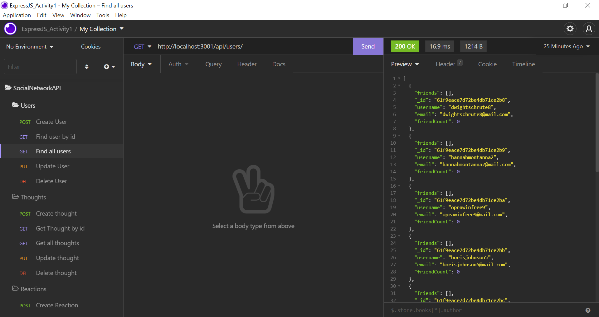

# Homework18-SocialNetworkAPI
Homework 18: Social Network API

## Contents
- [Description](#Description)
- [Screenshot](Screenshot)
- [Liscence](#Liscence)
- [Contributors](#Contributors)
- [GitHub Repository Link](#GitHubRepositoryLink)
- [Video Recording Link](#VideoRecordingLink)

## Description:
    This social network application backend uses MongoDB and Mongoose npm packages. MongoDB was chosen over SQL so that a schema would not have to be used for the irregularity of social network data. Other technologies include ExpressJS for routing and the Insomnia Application for testing routes.

## Screenshot

## Liscence
    MIT
## Contribiutors
    Calvin Swomley | calvinswomley@gmail.com | [https://github.com/calvinswomley](https://github.com/calvinswomley)
## Github Link
    https://github.com/calvinswomley/Homework18-SocialNetworkAPI
## Walkthrough Video Link